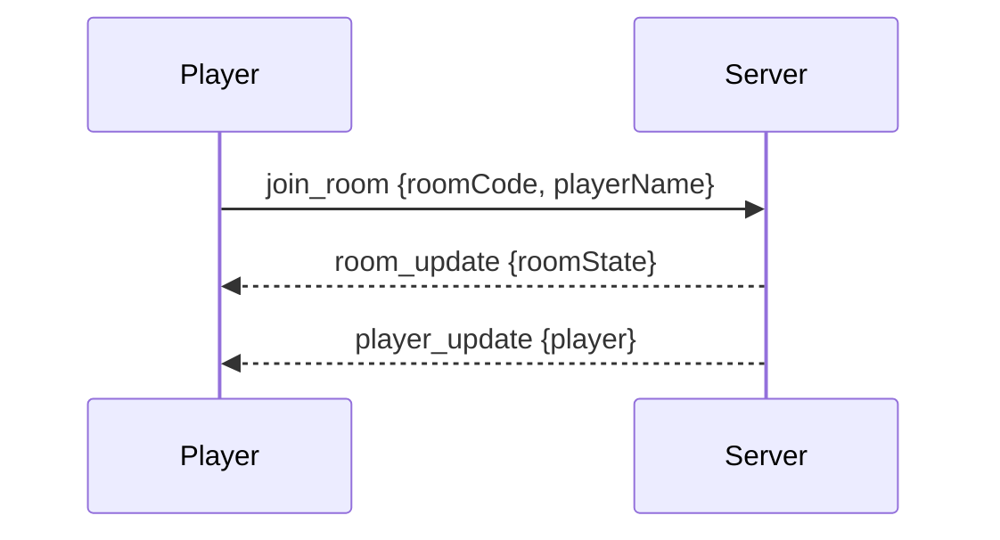
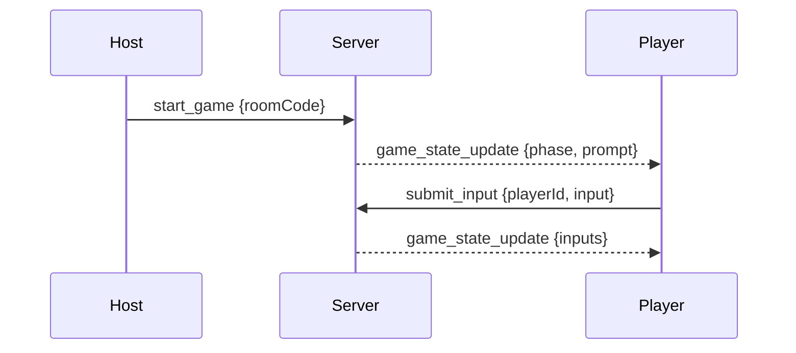

# Event Architecture

## Purpose

This document lists all major socket.io (WebSocket) events and payload formats used for real-time communication between backend and clients.

---

## Main Event List

| Event Name           | Direction        | Description                                     | Typical Payload Example                        |
|----------------------|------------------|-------------------------------------------------|------------------------------------------------|
| `join_room`          | client → server  | Player joins a game room                        | `{ roomCode: "ABCD", playerName: "Anna" }`     |
| `leave_room`         | client → server  | Player leaves the room                          | `{ roomCode: "ABCD", playerId: "xyz" }`        |
| `room_update`        | server → client  | Broadcast current state of room and player list | `{ roomState: GameRoom }`                      |
| `player_update`      | server → client  | Broadcast player changes (score, online, name)  | `{ player: Player }`                           |
| `start_game`         | client → server  | Host starts game                                | `{ roomCode: "ABCD" }`                         |
| `game_state_update`  | server → client  | Broadcast game phase, prompt, inputs, votes     | `{ gameState: GameState }`                     |
| `submit_input`       | client → server  | Player submits input/vote/answer                | `{ playerId: "xyz", input: "data" }`           |
| `vote`               | client → server  | Player submits a vote                           | `{ playerId: "xyz", vote: "ben" }`             |
| `error`              | server → client  | Describes error (name in use, room full, etc.)  | `{ message: "Player name already used" }`      |
| `timer_tick`         | server → client  | (optional) timer update for phase countdown     | `{ phase: "input", secondsLeft: 10 }`          |

---

## Example Event Flows

### Room Join



### Game Start and Input



---

## Payload Shapes

### GameRoom

```typescript
interface GameRoom {
  id: string;
  hostId: string;
  players: Player[];
  // ... 
}
```

### GameState

```typescript
interface GameState {
  roundIndex: number;
  gameId: string;
  phase: string;
  prompt?: string;
  inputs: { [playerId: string]: any };
  // ...
}
```

### Player

```typescript
interface Player {
  id: string;
  name: string;
  score: number;
  // ...
}
```

---

## Error Handling

- Errors are sent with the `error` event.
- Common codes: `"name_used"`, `"room_full"`, `"disconnect"`, etc.
- Always check for errors on join, input, and voting.

---

## Tips

- Always send only the minimal required payload for each event.
- Document changes and new event types in this file.

---

*Keep `docs/events.md` up-to-date with every change in event names, formats, or flows!*